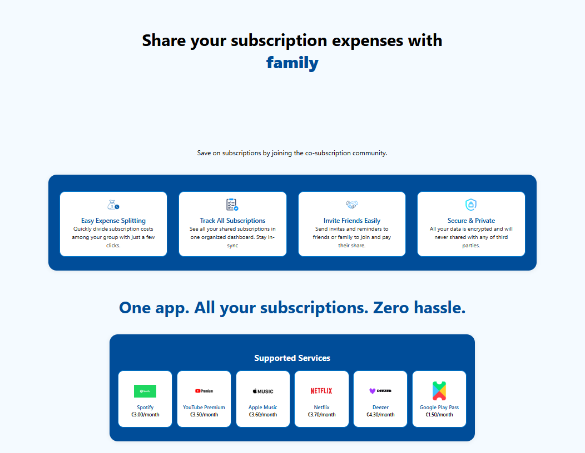
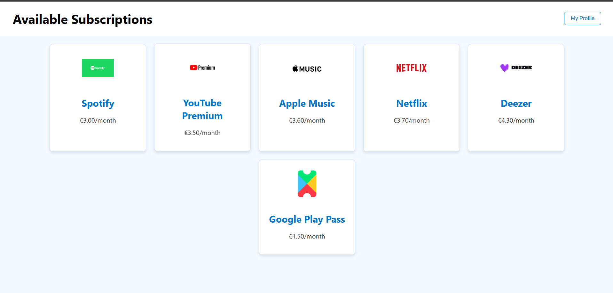
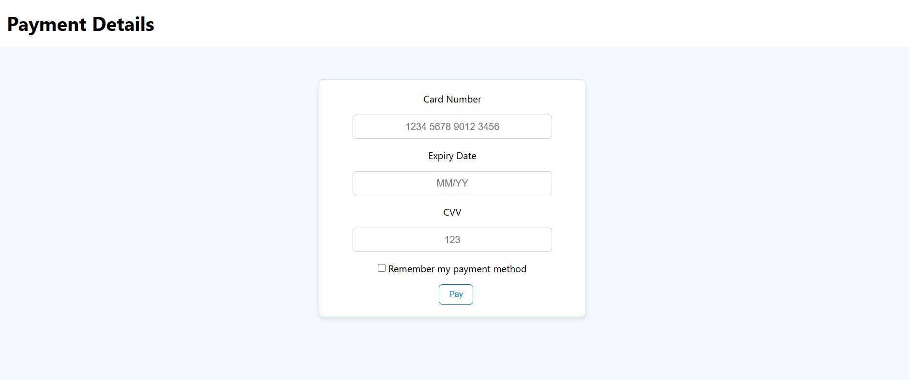
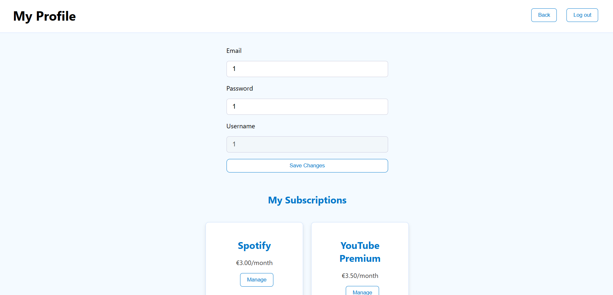

# SplitApp

SplitApp is an information system designed to support the fair and organized sharing of subscription costs.  
It helps students and young people reduce the financial burden of recurring subscription services (like Netflix, Spotify, YouTube Premium, Microsoft 365, etc.) by providing a lightweight tool to manage shared expenses.

---

## Project Overview

In the digital age, many essential platforms are available only through recurring payments. For students, these costs can be difficult to handle.  
While sharing subscriptions with friends or classmates is a common solution, it usually lacks proper organization and transparency.

**SplitApp provides:**
- Creation of groups for shared subscriptions  
- Adding and managing services (e.g., Netflix, Spotify)  
- Splitting costs among members  
- Tracking payments transparently  

Even if payments are manual, SplitApp reduces confusion, avoids misunderstandings, and helps students share costs fairly.

---

## 🛠️ Tech Stack

- **Frontend:** React (modern, component-based UI)
- **Backend:** Node.js (MySQL driver: `mysql` or `mysql2`)  
- **Database:** MySQL 8.0+ (compatible with MariaDB)  
- **Icons/Assets:** Stored as BLOBs inside database tables

---

## 🖼️ Screenshots

- **Main Page**  
  

- **List Of Subscriptions**  
  

- **Subscription Detailes**  
  

- **Payment**  
  

- **Dashboard**  
  

---

## 📄 License

This project is licensed under the **MIT License**.